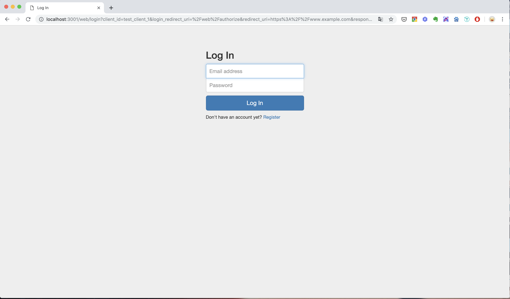
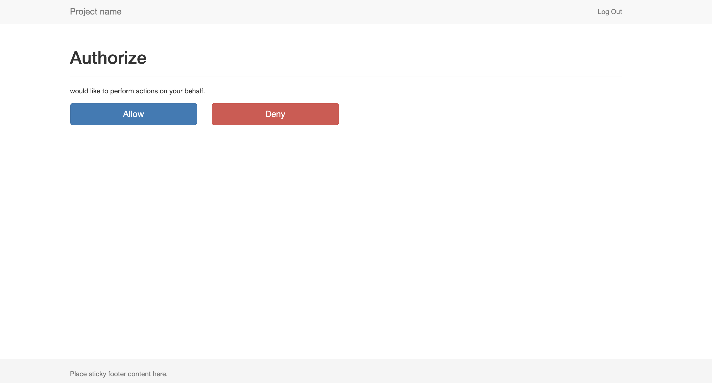
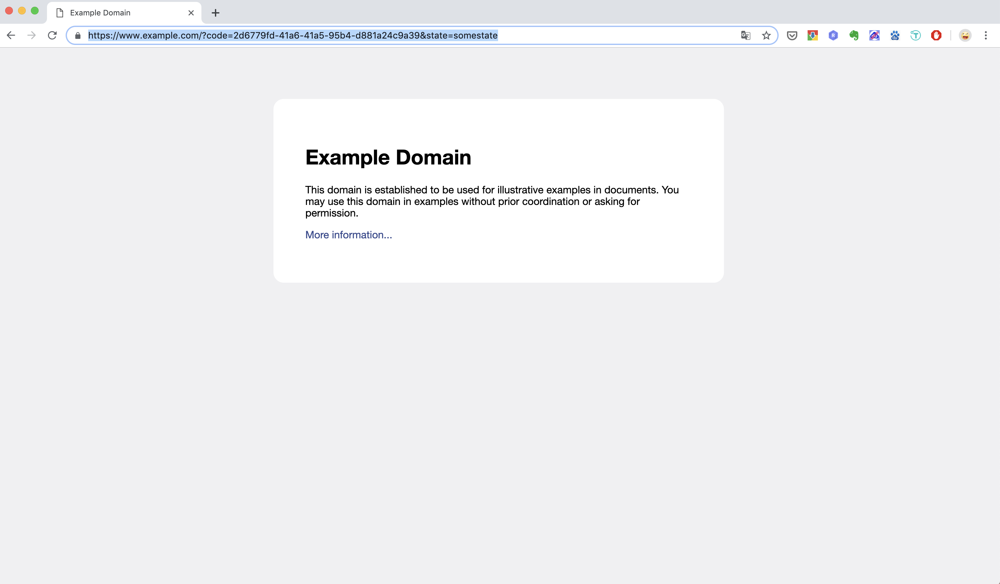
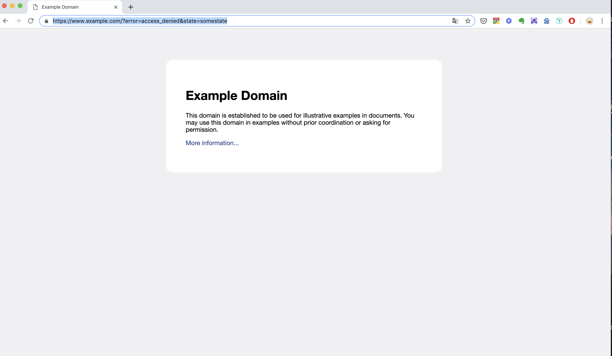

# oauth2服务器
## 构建步骤
### 注意
> 由于项目使用的是Go Modules作为包管理因此go的版本至少为go 1.11。
### 构建
```
go build 
```
下载不了的包需要翻墙或者在.mod里面添加替代的库，参考[在go modules中使用replace替换无法直接获取的package]('https://www.cnblogs.com/apocelipes/p/9609895.html')
### 初始化
```
./oauth2-server init
```
运行会创建相关的表
### 加载数据
```
./oauth2-server loadData oauth/fixtures/scopes.yml oauth/fixtures/roles.yml oauth/fixtures/test_clients.yml oauth/fixtures/test_users.yml
```
加载测试数据数据(数据在oauth/fixtures目录下)
### 运行
```
./oauth2-server run
```

## 程序测试
### 授权码模式
- 参考(http://tools.ietf.org/html/rfc6749#section-4.1)
- 浏览器发起授权码请求
```
http://localhost:3001/web/authorize?client_id=test_client_1&redirect_uri=https://www.example.com&response_type=code&state=somestate&scope=read_write
```
- 提示登录，可以注册然后登录

- 提示用户是否授权应用(test_client_1)访问用户的用户信息

- 同意授权，则重定向到应用制定的uri（redirect_uri的值），同时在uri中有授权码。

响应：
```
https://www.example.com/?code=2d6779fd-41a6-41a5-95b4-d881a24c9a39&state=somestate
```
- 拒绝授权

响应：
```
https://www.example.com/?error=access_denied&state=somestate
```
- 使用授权码可以获取访问的token

### 


## go get翻墙(前提安装ss)
- windows
新建proxy.bat并添加到PATH中
```bat
@echo off
set http_proxy=socks5://127.0.0.1:1080
set https_proxy=socks5://127.0.0.1:1080
go get -u -v %*
echo ...
pause
```
然后就可以使用
proxy.bat golang.org/x/crypto
- mac或linux
需要修改为软件对应的端口号。
```
alias proxy='ALL_PROXY=socks5://127.0.0.1:1086/ \
        http_proxy=http://127.0.0.1:1087/ \
        https_proxy=http://127.0.0.1:1087/ \
        HTTP_PROXY=http://127.0.0.1:1087/ \
        HTTPS_PROXY=http://127.0.0.1:1087/'
```
直接运行上面命令或者添加到配置文件后，可以使用
proxy go get golang.org/x/crypto